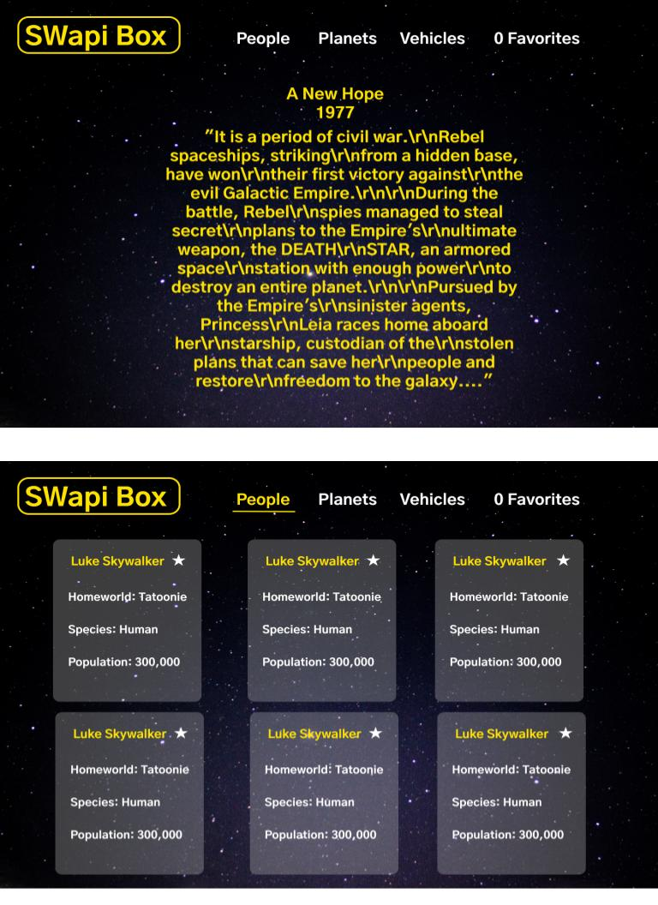

# SWapi Box

The goal of this project was to create a React application with data from the Star Wars API.  

### Setup Frontend

Clone this repo  
Run `npm install` from the root directory  
Run `npm start` and visit localhost:3000 in your browser

### Preview

### Primary Technologies Used

* React
* JavaScript
* CSS/SCSS

### Testing:

Jest and Enzyme for front-end testing  
Run `npm test` from the root directory

### Original Assessment

[SWAPIbox](http://frontend.turing.io/projects/swapi-box.html) project from Turing School of Software and Design

### Wireframes

  

This project was bootstrapped with [Create React App](https://github.com/facebook/create-react-app).